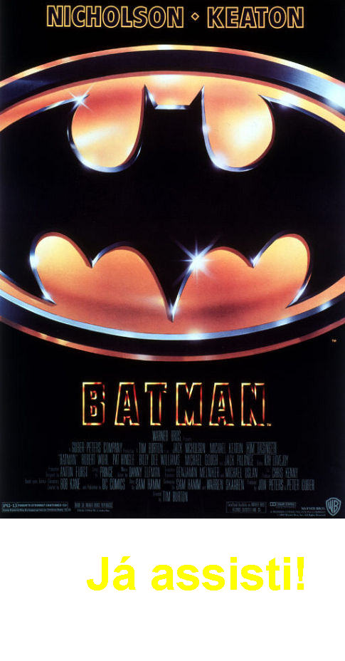
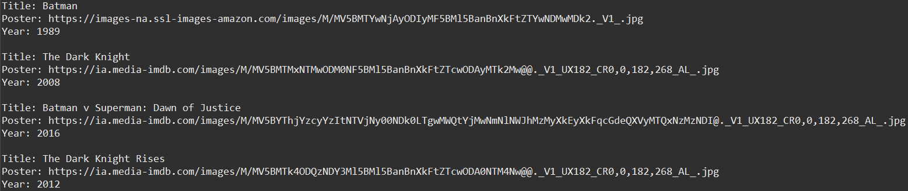
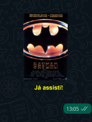

# Nexus Stickers

Project developed at Alura's Java Immersion, aiming to create an application that will consume data from an API in order to create personalized stickers to be sent on WhatsApp.

| Dev Showcase |                                       |
| ------------ | ------------------------------------- |
| ✨ Name      | Nexus Stickers                        |
| 🏷️ Techs     | Java, Git                             |
| 🤿 Challenge | https://www.alura.com.br/imersao-java |

## 🔨 Techs

### ✅ 1st day result

### ✅ 2nd day result

